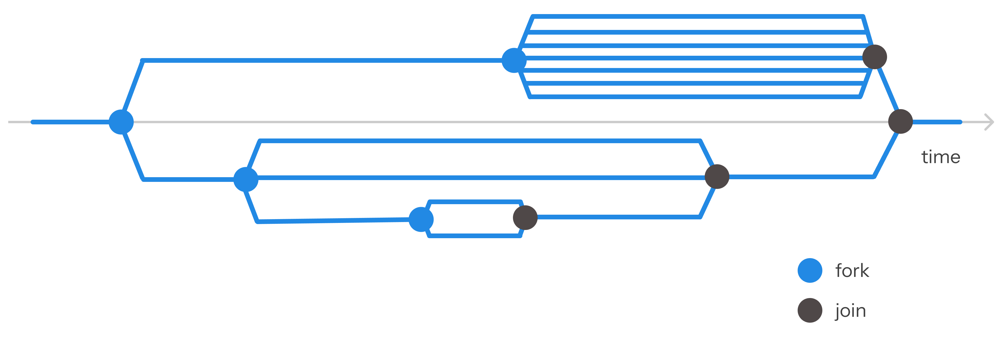
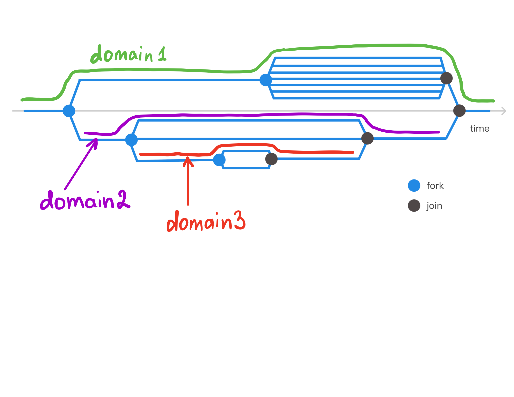

# Multicore OxCaml - portability and contention tutorial

This tutorial covers portability and contention modes that ensure data race freedom and does not cover atomics, capsules, and mutexes. By the end of this tutorial, you will be able to write correct multidomain programs that do not use shared mutable state. Not every pattern you might be used to from different programming languages is expressible in OxCaml, so we'll show examples on how to restructure your programs to fit OxCaml's approach.

### Multicore OCaml

OCaml 5.0 introduced multicore support. Multicore here means multithreaded (multidomain) execution of code, that is, an ability to execute code in parallel within the same OS process, with all threads (domains) sharing the same memory space.

OCaml uses the term **domain** which roughly corresponds to a thread. We use the terms **multicore**, **multidomain**, and **parallel** to mean the same thing. Other programming languages use the term *multithreaded*. And sometimes, confusingly, *concurrent* is also used to mean parallel.

### Multidomain is different from multiprocess and asynchronous

There exist multiple paradigms to speed up or structure computations.

**Multiprocess** computing allows creating subprograms that execute on multiple cores (as scheduled by the OS) and communicate with each other via shared memory, but they do not share memory like domains do. Communication between processes is possible via IPC primitives like pipes, but is much slower than accessing the same memory locations in domains.

**Asynchronous** (or sometimes **concurrent**, confusingly) computation frameworks (e.g. the Async library) can work with a single thread and stash waiting IO computations so that the thread can be used for other computations before the IO results are actually needed. In contrast, multidomain computing in OxCaml is meant to be used for CPU-intensive computations when each core is expected to be fully utilized, rather than waiting for IO.

All these paradigms can often be combined. But here we will focus on multidomain computing only.

### Data race definition
One of the main pitfalls of multidomain computing is *data races*.

**Data race** is a condition when two or more domains access the same memory location, and at least one of them performs a write to that memory location. Given a value, a read + write and a write + write will produce a data race, while a read + read without any other writes will not.

```
(* A data race on x *)
let x = ref 0

(* Domain A *)
x := 1

(* Domain B *)
x := 2
```

Due to how CPUs are designed, this situation can lead to unexpected results. Moreover, compilers often produce optimizations assuming that programs do not contain data races. Thus, data races are usually prohibited and considered a bug.

In the program above, the value of `x` could be `1`, `2`, or anything else and some other unexpected things might happen, depending on compiler and language guarantees.

### Multicore OxCaml guarantees data race freedom

OxCaml brings an extension to multicore OCaml to ensure data race freedom in **compile time**. If an OxCaml program has compiled successfully, it is guaranteed that no data race can occur in the program. This is achieved by introducing **portability** and **contention** modes.

**Modes** are annotations that constrain how a value may be used. Modes are checked at compile time. There exist at least nine separate mode axes in OxCaml, but we will focus on two of them: *portability* (portable and nonportable modes) and *contention* (contended and uncontended modes).

### Fork-join model

OxCaml's `parallel` library uses a fork-join model for multidomain execution. Under this model's API, we can submit functions to be executed in parallel, and the library code will work out *scheduling* of these computations. That is, it will decide which domains will run which computations.

#### Example

Here we pass two computations: `a + b` and `c + d` into `Parallel.fork_join2`, wait until both of them finish, and sum their results. When we submit `test_add4` to the scheduler, it will assign domains to run these computations. These might be two different domains, or a single domain might run both computations.

By waiting until both computations finish, we mean that, unlike under asynchronous execution, the current thread will not be executing any following instructions until both computations finish. Also, there's neither the active nor blocking waiting, that you might be familiar with from other languages, is happening. In fact, in `fork_join2`, the current thread will also participate in computing the submitted computations.

We also pass `par: Parallel.t`, which is an object that allows the scheduler to control the parallel computations.

Note: here we use another new feature of OxCaml, [unboxed types](https://oxcaml.org/documentation/unboxed-types/01-intro/). `fork_join2` returns an unboxed tuple, so we pattern match an unboxed tuple with `let #(x, y) = ...`, so that the labels `x` and `y` now refer to the boxed values that we can use to contruct the return value.

```ocaml
let add4 (par : Parallel.t) a b c d =
  let #(a_plus_b, c_plus_d) =
    Parallel.fork_join2 par
      (fun _par -> a + b)
      (fun _par -> c + d)
  in
  a_plus_b + c_plus_d
;;

let test_add4 par = add4 par 1 10 100 1000

(* result: 1111 *)
```

To run the code above, include `parallel` and `parallel.scheduler` libraries into your `dune` config, create a scheduler, and pass the parallel computation to it. We will omit the scheduler creation and result-printing code from snippets from now on.
```ocaml
let run_one_test ~(f : Parallel.t @ local -> 'a) : 'a =
  let module Scheduler = Parallel_scheduler in
  let scheduler = Scheduler.create () in
  let result = Scheduler.parallel scheduler ~f in
  Scheduler.stop scheduler;
  result
;;

let () =
  let result = run_one_test ~f:test_add4 in
  Printf.printf "result: %d\n" result
;;
```
#### Structure
Note that we use `Parallel.fork_join2` to spawn two computations, but there exist `fork_join3`, `4` and `5`, or plain `fork_join` which accepts a list of computations to run in parallel.

Each computation passed to `fork_join*` can itself start inner parallel computations by calling `fork_join*` again. A fork-join group of computations finishes when the last computation in the group finishes.

On the diagram below, a blue dot corresponds to a call to `fork_join*` and submission of several computations. We call it a *fork*. The blue horizontal lines indicate the time during which each of the computations could be executing. The black dot corresponds to the moment all computations in the fork have finished and the `fork_join*` function has returned. We call this moment a *join*.

Note that the blue horizontal lines do not necessarily mean that each computation is executing all the time a blue horizontal line runs. Indeed, some computations could finish very quickly, and some could be waiting for a scheduler to schedule them once a CPU core becomes free from performing other computations. We only know that each computation will be executed at some point between a fork and a join, and we will promptly join once the last computation is finished.



### Domain-preservation property
OxCaml's **fork-join preserves the domain of execution for the first forked computation** passed to the `Parallel.fork_join*` function.

This incredibly important property allows us to use mutable states between fork-join computations on the same *line*, since it is guaranteed to be executed on the same domain. We'll cover that later in more detail.

On the diagram below, the lines marked `domain1`, `domain2`, and `domain3` trace computations that will be executed on the same domain, for each of the lines. There is no other line that is guaranteed to preserve a domain.

Note that other forked computations may also be executed on these domains, and some or all of these domains could even be the same domain. But we don't care much about those details.

Note that the diagram doesn't show the domains used in this computation. Rather, it only shows the domains that are guaranteed to stay the same for certain groups of computations.



### Data race program

Now that we are familiar with the fork-join model, let's see what a program with a data race could look like in this model. Recall that a data race happens when two or more domains access the same memory location, and at least one of them performs a write to that memory location. 

Consider the following problem. Given a list of daily closing prices for a security and a threshold price, count the number of days when the closing price > threshold. We have a sequential solution which we'd like to parallelize.

```ocaml
let prices = [ 3.5; 2.1; 3.3; 5.7; 1.8 ]
let threshold = 2.0

let count_profitable_days prices threshold =
  List.count prices ~f:(fun price -> Float.(price > threshold))
;;

count_profitable_days prices threshold (* result: 4 *)
```

We'd like to speed up the computation by parallelizing by data: split the list in two and count each part on its own domain. We define a counter and a new function `count_profitable_days_inner` which iterates over a list and increments the count if the price is > threshold.

```ocaml
(*  Does not compile: data race on count *)
let count_profitable_days_par (par : Parallel.t) prices threshold =
  let count = ref 0 in
  let left, right = List.split_n prices (List.length prices / 2) in
  let count_profitable_days_inner lst =
    List.iter lst ~f:(fun price -> 
      if Float.(price > threshold) then count := !count + 1)
  in
  let _ =
    Parallel.fork_join2
      par
      (fun _par -> count_profitable_days_inner left)
      (fun _par -> count_profitable_days_inner right)
  in
  !count
;;
```

Fortunately, this program won't compile and produce the following error:
```
(fun _par -> count_profitable_days_inner right)
             ^^^^^^^^^^^^^^^^^^^^^^^^^^^
Error: The value count_profitable_days_inner is nonportable
       because it contains a usage of the value count
       which is expected to be uncontended.
       However, the highlighted value count_profitable_days_inner is expected to be portable
       because it is used inside a function which is expected to be portable.
```

Indeed, this program contains a data race on the `count` value. We'll learn to decipher such compiler messages in a moment, but for now let's think of all the ways to fix this program.

We can add a mutex, make `count` atomic, or use local counters. In this tutorial, we'll focus on the latter approach and only cover programs **without shared mutable state**. Atomics and synchronization primitives (such as a mutex) will be covered in a later tutorial.

With local counters, we can reuse the sequential version and rewrite the parallel version as follows. As a bonus, this program now even looks more functional-style. Pure functions are straightforward and safe to parallelize.

```ocaml
let count_profitable_days_par (par : Parallel.t) prices threshold =
  let left, right = List.split_n prices (List.length prices / 2) in
  let #(left_count, right_count) =
    Parallel.fork_join2
      par
      (fun _par -> count_profitable_days left threshold)
      (fun _par -> count_profitable_days right threshold)
  in
  left_count + right_count
;;
```

### Correct programs
By correct programs we mean programs that do not contain data races.

In this tutorial we only consider those correct programs which also do not use shared mutable state.

So let's briefly describe the set of such programs, and then we'll empirically convince ourselves that the portability and contention rules indeed describe the same set of correct programs. That is, the compiler will accept all the programs we expect to be correct and reject all the other ones.

TODO

### Contention and portability

Recall that *modes* are a set of annotations that constrain how a value may be used, that are inferred and type-checked at compile time. Contention and portability are two mode axes.

We've written two correct parallel programs and haven't used any portability or contention annotations. Fortunately, so far, the compiler was able to infer such annotations on its own and prove the correctness of those programs. Let's discuss what these annotations are and then look at cases when the compiler is unable to infer annotations for correct programs, and we need to add annotations manually.

Some of the concepts related to contention and portability are somewhat circular, but we did our best to come up with a linear explanation. We recommend speeding through this section on the first read to get a general feel and then re-reading it more thoughtfully for the second time.

#### Contention
Contention mode axis defines two annotations: `@ contended` and `@ uncontended`.

Contention mode applies to values containing **data** and describes privileges for domains for reading and writing to such a value.

Contention mode only applies to values that contain a **mutable state**. Indeed, an immutable value can always be safely read by multiple domains, so annotations become irrelevant. We say **immutable values cross contention** to mean that immutable values can be treated both as contended and uncontended values.

A value in an uncontended mode gives a privilege to a single domain to read or write to such a value. A value in the contended mode gives a guarantee that the value cannot be modified or read.

Immutable values are often used in the contended mode, since this is the most restrictive mode which gives the most guarantees and more usability (multiple domains can access the value). The immutable values do not need to claim any of the privileges provided by the uncontended mode: they cannot be written to because they are immutable, and they can be read from by any domain because they cross contention.

Let's see some examples.

Recall that `ref` is a record with a single mutable field.

Let's consider a few quick examples. Out of the following definitions, only `let get_plus_one_ref_cont (r @ contended) = !r + 1` will not compile: `r` must be uncontended for read access, since it's mutable.

```ocaml
let x_cont @ contended = 42
let c_uncont @ uncontended = 42

let lst_cont @ contended = [ 1; 2; 3 ]
let lst_uncont @ uncontended = [ 1; 2; 3 ]

let r_cont @ contended = ref 0 (*  Useless. Cannot read or write. *)
let r_uncont @ uncontended = ref 0

let ref_lst_cont @ contended = [ ref 0; ref 0; ref 0 ]
let ref_lst_uncont @ uncontended = [ ref 0; ref 0; ref 0 ]

let len_cont (lst @ contended) = List.length lst
let len_uncont (lst @ uncontended) = List.length lst

let get_plus_one_cont (x @ contended) = x + 1
let get_plus_one_uncont (x @ uncontended) = x + 1

(* let get_plus_one_ref_cont (r @ contended) = !r + 1 *)  (* Does not compile *)
let get_plus_one_ref_uncont (r @ uncontended) = !r + 1
```

If we actually attempt to pass all possible arguments to all possible functions defined in the above examples, only `len_uncont ref_lst_cont` and `get_plus_one_ref_uncont r_cont` will not compile.

Note that if we have a mutable state in a value, we cannot pretend that it is immutable, slap `@ contended` on it, and expect to be able to read the value from multiple domains. If we want to use a mutable state at all, it must be uncontended and accessed from a single domain.

```ocaml
(*  Does not compile *)
(*  Even a read access from mutable state is not allowed.*)
let get_plus_one_ref_uncont (r @ contended) = !r + 1
```

TODO: elaborate on why `len_uncont ref_lst_cont` fails, and why having `r_cont` might be useful (e.g., we want to have a contended record, but it has a mutable field, which we are happy to ignore).

#### Portability
Portability mode axis defines two annotations, written with a double @@: `@@ portable` and `@@ nonportable` when applied to functions and with a single @: `@ portable` and `@ nonportable` when applied to values possibly containing functions.

Portability mode applies to functions and describes restrictions on whether a function may be invoked in multiple domains.

Let's take a look at some functions and values possibly containing functions, like lists, tuples, arrays, variants, and records.

TODO: add a record example

TODO: elaborate on "possibly containing functions" (some records may contain functions even if it's not straight away obvious, so we have to annotate almost all values)

```ocaml
(*  Examples of functions and values possibly containing functions. *)
(*  @@ portable/@@ nonportable and @ portable/@ nonportable applies. *)

let f x = x + 1 (* a function *)
let lst = [f; f; f]
let func_and_arg_tuple = (fun y -> y + 1, 42)
let functions_array = [|
  (fun x -> x + 1); 
  (fun x -> x * 2); 
  (fun x -> x * x);
|]

(* NOTE: portable/nonportable does not apply to types.
It only applies to functions or values. 
It will apply to values of this particular type, since it may contain a function *)
type func_or_arg =
  | Func of (int -> int)
  | Arg of int
;;

let variant1 = Arg 42  (* portable/nonportable applies because may contain a function *)
let variant2 = Func f

let array_of_variants = [|  (* portable/nonportable applies *)
  Arg 42; 
  Arg 42;
  Arg 42;
|]
```

**From now on, we will say "a function" meaning "a function or a value possibly containing a function."**

TODO: rephrase nonportable (too hard to comprehend)

**Portable** functions can be used in multiple domains and guarantee that they do not access any shared mutable state. **Nonportable** functions may access shared mutable state and thus can only be used in the domain where those functions were defined.

Let's take a look at under which modes we can use various functions.

TODO: portability examples (a good example set will probably contain a note on why arguments to a function are "inside the function definition")

```ocaml
let f x = x + 1 @@ portable
let f x = x + 1 @@ nonportable

let r = ref 0
let f = r := 42 @@ nonportable
```

### Contention and portability reference
Here's a summary of the above discussion and the formal rules checked by the compiler for a quick reference. Feel free to check that the interpretation adheres to the rules.

#### Contention summary (uncontended - contended)
##### Interpretation
- Applies to data.
- Immutable values cross contention (usually used as `@ contended`).
- `@ uncontended` is a privilege to read or write to a value, by a single domain.
- `@ contended` is a guarantee that the value cannot be modified or read.

##### Rules
1. At most one domain may consider a value **uncontended**.
2. Reading from or writing into a value is only allowed if the enclosing term is **uncontended**.
3. (R/W privilege drop.) An **uncontended** value may be treated as **contended**.
4. (Deepness.) Any component of a **contended** value is **contended**.

#### Portability summary (portable - nonportable)
##### Interpretation
- Applies to functions (`@@ portable` / `@@ nonportable`) and values containing functions (`@ portable` / `@ nonportable`).
- `portable` is a permission to use a function (or a value containing a function) in multiple domains and a guarantee that it will behave well: not access any shared mutable state in the uncontended mode.
- `nonportable` is a restriction to using a function (or a value containing a function) in the same domain where it was defined.

##### Rules
1. Only a portable value is safe to access outside the domain that created it.
2. If **portable** refers to a value outside its own definition,
  - that value must be **portable**;
  - the value is treated as **contended**.
3. (Usage permission drop.) A **portable** value may be treated as **nonportable**.
4. (Deepness.) Any component of **portable** must be **portable**.

TODO: understand if the different wording of "must be" and "is treated as" actually encodes a distinction.

### Arguments to a function are "inside the function definition"
TODO

### Portability and contention in the fork-join model
Let's take a closer look at the `parallel` library which provides us with `fork_join*` family of functions.

```ocaml
let run (par : Parallel.t) =
  let #(result1, result2) =
    Parallel.fork_join2 par
      (fun _par -> 1)
      (fun _par -> 42)
  in
  result1 + result2
;;

let run_one_test ~(f : Parallel.t @ local -> 'a) : 'a =
  let module Scheduler = Parallel_scheduler in
  let scheduler = Scheduler.create () in
  let result = Scheduler.parallel scheduler ~f in
  Scheduler.stop scheduler;
  result
;;

let () = run_one_test ~f:run
```

This library creates and manages domains, so it must adhere to portability and contention rules itself. Let's check that they are necessary and sufficient.

`Scheduler.parallel scheduler ~f` requires `f` to be `portable`. This seems fair, since it could run our code on any domain. However, it feels like we might not be able to express everything we want to. We agreed that we are not going to modify *shared* mutable state in this tutorial yet, but we still want to be able to modify mutable states, as long as they are not shared between domains.

For example, a program where one domain modifies a global value `x`, and no other domains access `x` is a correct, data-race free program.
```ocaml
(* Does not compile *)

(* Global state, created before any domains were ever created in the program. *)
let x = ref 0

(* Domain A *)
let () = x := 42; !x

(* Domain B *)
let () = 1729
```

TODO: is this not expressible in the fork-join model or OxCaml itself? I.e., in OxCaml, we cannot track global state access across modules? i.e., I want to motivate that this global access restriction is necessary. The next two paragraphs mix the blame between the fork-join model and OxCaml. Needs to be clarified whose restriction it is.

Unfortunately, we cannot exactly express the program above with the fork-join library, since the function running on domain A is nonportable, but anything passed into `Scheduler.parallel` must be portable.

However, with some gentle tweaks, you can adjust most, if not all, data-race free programs to type-check under OxCaml.

Recall that `fork_join*` runs the first argument on the same domain that `fork_join*` was called on. This clever design allows us to modify state that was created within the `fork_join*` in the function passed to the first argument. And the `fork_join2` signature reflects this fact:

```ocaml
val fork_join2
  :  t @ local
  -> (t @ local -> 'a) @ local once
  -> (t @ local -> 'b) @ once portable
  -> #('a * 'b)
```

The fisrt argument to any function within the `fork_join*` family could be nonportable.

This helps us rewrite our example above to the following. Here `x := 42; !x` in nonportable, but `fork_join*` is ok with this.
```ocaml
(* Compiles *)
let run (par : Parallel.t) =
  let x = ref 0 in
  let #(result1, result2) =
    Parallel.fork_join2 par
      (fun _par -> x := 42; !x)
      (fun _par -> 1729)
  in
  result1, result2  (* result: (42, 1729) *)
;;
```

The rest of the arguments to `fork_join*` required to be portable, since they can be run on any domain. However, if they call `fork_join*` themselves, their first argument to that inner `fork_join*` could again be nonportable, modifying some local mutable state created within that branch. Here `x := 42; !x` and `y := 17; !y` are both nonportable.

```ocaml
(* Compiles *)
let run (par : Parallel.t) =
  let x = ref 0 in
  let #(result1, result2) =
    Parallel.fork_join2 par
      (fun _par -> x := 42; !x)
      (fun _par -> let y = ref 0 in 
                     let #(inner_r1, inner_r2) = 
                     Parallel.fork_join2 par 
                       (fun _par -> y := 17; !y) 
                       (fun _par -> 29)
                     in
                     inner_r1, inner_r2)
  in
  result1, result2  (* result: (42, (17, 29))) *)
;;
```

If the first branch of the inner fork-join calls `fork_join*` again, it can also pass a nonportable function, modifying `y`, to its first argument, thus stretching this value through two forks.

The practical takeaway is that **all the functions used in `Scheduler.parallel` must be `portable`. The first argument to `fork_join*` can be nonportable,** as long as it remains portable from the `Scheduler.parallel`'s perspective.

### Annotating example
Let's discuss an example when we need to manually annotate portability and contention modes.

We'd like to calculate properties of a stock (is a penny stock, is a five-digit stock) given its price.

Motivation: you need to know the properties of a stock before you can safely work with it. Calculating properties is independent of each other and also takes a long time, so you parallelize the computation by instructions (same data, different instructions).

```ocaml
(*  Compiles *)
module Stock = struct
  type t = { price : float }

  let create ~price = { price }
  let price { price } = price
end

let calc_stock_properties (par : Parallel.t) stock =
  let is_penny_stock stock = Float.(Stock.price stock < 1.0) in
  let is_five_digit_stock stock = Float.(Stock.price stock >= 10000.0) in
  let #(is_penny, is_five_digit) =
    Parallel.fork_join2
      par
      (fun _par -> is_penny_stock stock)
      (fun _par -> is_five_digit_stock stock)
  in
  is_penny, is_five_digit
;;

let stock1 = Stock.create ~price:0.07
let run par = calc_stock_properties par stock1 (* result: true false *)
```

Now let's extract the `Stock` record into a separate module.

```ocaml
(*  lib/stock.mli *)
type t

val create : price:float -> t
val price : t -> float
```

```ocaml
(*  lib/stock.ml *)
type t = { price : float }

let create ~price = { price }
let price { price } = price
```

Now this example does not compile. The compiler can now only see the Stock's signature in `stock.mli`, and cannot see the implementation in `stock.ml`. The implementation contained crucial information for mode inference, so now we need to add explicit mode annotations to convince the compiler that there's no possibility for a data race.

Compiler output:

```ocaml 
XX |       (fun _par -> is_five_digit_stock stock)
                        ^^^^^^^^^^^^^^^^^^^
Error: The value is_five_digit_stock is nonportable
       because it closes over the value Stock.price
       which is nonportable.
       However, the highlighted value is_five_digit_stock is expected to be portable
       because it is used inside a function which is expected to be portable.
```

You can only pass a portable function to `fork_join2`'s second fork branch, so the compiler expects `is_five_digit_stock` to be portable. By default, though, all functions are nonportable (the least number of guarantees), so the compiler tries to check if it can prove that `is_five_digit_stock` is portable. Portable functions must in turn use portable functions only. `is_five_digit_stock` uses the `Stock.price` getter. However, the compiler doesn't have access to the `Stock.price` implementation after we moved it to `stock.mli`, so it can't check if its implementation adheres to portability rules, so it must pessimize and conclude that `Stock.price` is nonportable. Indeed, `Stock.price` might be calling some nonportable functions internally or break the portability requirements itself by accessing uncontended data (e.g. writing to a global value).

Fix: annotate `Stock.price` as `@@ portable`.

```ocaml
(*  lib/stock.mli *)
type t

val create : price:float -> t
val price : t -> float @@ portable
```

Compiler output:
```ocaml
XX |       (fun _par -> is_five_digit_stock stock)
                                            ^^^^^
Error: This value is contended but is expected to be uncontended.
```
(Syntax refresher: `Stock.price` refers to the function, not the field.)

`is_five_digit_stock` and `Stock.price` are portable. But `Stock.price` is allowed to modify `stock` and remain portable since `stock` is a local value from its perspective. However, the function with a binded argument `let () = is_five_digit_stock stock` is using a value outside of its own definition, and passes it to the function `Stock.price` which takes its argument uncontended, since it could be modifying the argument, so the binded function cannot be inferred as portable. But `fork_join2` requires its second fork branch to be portable. Now it's the caller's responsibility to ensure that `stock` is contended and doesn't break the portability.

Fix: annotate t passed into the price getter as `t @ contended`. Now the `Stock.price` getter cannot modify the stock.

```ocaml
(*  lib/stock.mli *)
type t

val create : price:float -> t
val price : t @ contended -> float @@ portable
```

Compiler output:

```ocaml
XX | let run par = calc_stock_properties par stock
                                                  ^^^^^
Error: This value is nonportable but is expected to be portable.
```

Since `run` is passed to the scheduler, it is required to be portable, and all the values outside of its own definition that it references must also be portable. However, `stock` is a record with unknown fields, and some of these fields might contain a nonportable function. If we allow `stock` to sneak in being nonportable, then `Stock.price` could call that hidden function and create a data race.

Fix: annotate the value returned from `Stock.create` as `@ portable`.
```ocaml
(*  lib/stock.mli *)
type t

val create : price:float -> t @ portable
val price : t @ contended -> float @@ portable
```

Now it compiles!

## What's next
Feel free to play with the code samples. One exercise could be adding annotations to examples that compile without annotations, to make sure your point of view matches the compiler's.

Go over the [official tutorial](https://github.com/oxcaml/oxcaml/blob/main/jane/doc/extensions/_01-tutorials/01-intro-to-parallelism-part-1.md). It has almost the same information but puts slightly different accents. The [Niceties](https://github.com/oxcaml/oxcaml/blob/main/jane/doc/extensions/_01-tutorials/01-intro-to-parallelism-part-1.md#niceties) section and below add more information.
